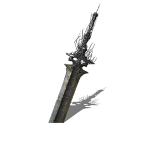

# DarkSword VM

	

a virtual machine with interpreter and just-in-time compilation for LLVM IR.

Machine Code: RV32I, running in ravel.

## Usage

This project is attached to [Masterball](https://github.com/SiriusNEO/Masterball) Compiler.

Drag the directory `darksword` into the `src` directory in [Masterball](https://github.com/SiriusNEO/Masterball). and run `DarkSwordVM` .

## TODO

- [x] Interpreter (`Masterball FrontEnd + DarkSword Interpreter ` passed all codegen testcases.)
- [ ] Simple JIT (method-based or BB-based...), context switch between JIT and Interpreter
- [ ] JIT Optimization